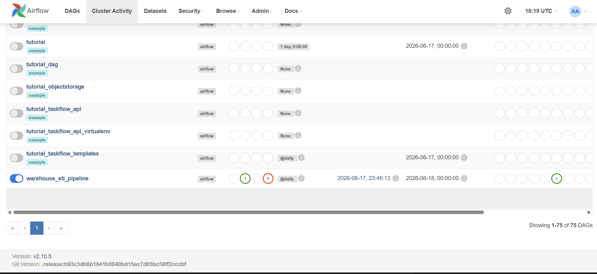
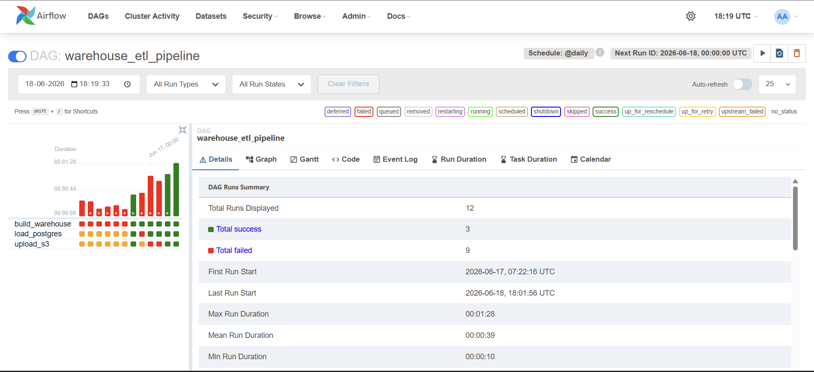
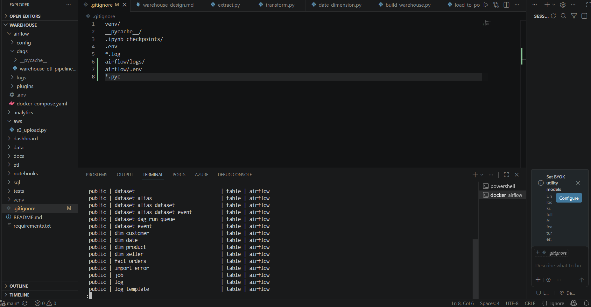
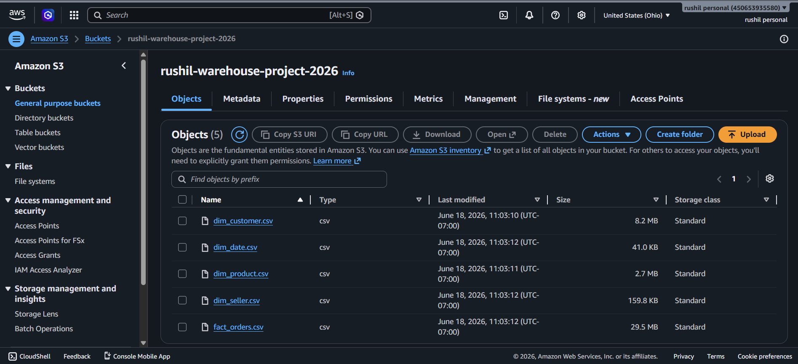

# End-to-End ETL & Data Warehouse System

## Overview

This project demonstrates the design and implementation of a modern end-to-end data warehouse pipeline using Python, PostgreSQL, AWS S3, Docker, and Apache Airflow. The pipeline ingests raw Brazilian e-commerce data, transforms it into dimensional warehouse tables, loads the data into PostgreSQL, uploads processed outputs to Amazon S3, and orchestrates the complete workflow using Apache Airflow.

---

## Architecture

```
Raw Olist Dataset
        ↓
Python ETL Pipeline
        ↓
Dimension & Fact Tables
        ↓
PostgreSQL Data Warehouse
        ↓
AWS S3 Cloud Storage
        ↓
Apache Airflow Workflow Orchestration
```

---

## Tech Stack

* Python
* Pandas
* PostgreSQL
* SQLAlchemy
* AWS S3
* Boto3
* Apache Airflow
* Docker
* Git & GitHub

---

## Dataset

**Brazilian E-Commerce Public Dataset by Olist**

---

## Data Warehouse Schema

### Dimension Tables

* dim_customer
* dim_product
* dim_seller
* dim_date

### Fact Table

* fact_orders

---

## Features

* Built ETL workflows to extract and transform raw e-commerce datasets.
* Designed a dimensional warehouse schema with fact and dimension tables.
* Loaded warehouse tables into PostgreSQL for analytical workloads.
* Uploaded processed outputs to AWS S3 for cloud storage.
* Automated the complete pipeline using Apache Airflow.
* Containerized the environment using Docker for reproducible deployment.

---

## Airflow Pipeline

```
build_warehouse
       ↓
load_postgres
       ↓
upload_s3
```

---

## Sample Analytics

* Total Revenue Analysis
* Order Volume Trends
* Top Seller Performance
* Product Category Insights

---

## Project Structure

```
warehouse
│
├── airflow
├── aws
├── data
│   ├── raw
│   └── processed
├── etl
├── notebooks
├── sql
├── docs
├── README.md
└── requirements.txt
```

---

## Future Enhancements

* Power BI dashboard integration
* Amazon Redshift deployment
* DBT transformations
* Real-time streaming with Kafka
* CI/CD pipeline with GitHub Actions

---
## Screenshots

### Airflow DAG Graph



---

### Airflow Grid View



---

### PostgreSQL Warehouse Tables



---

### AWS S3 Bucket



---
## Project Status

✅ Completed
